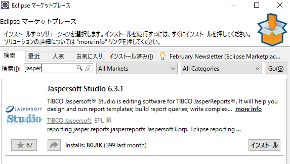
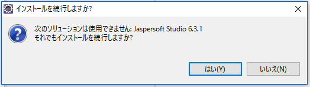
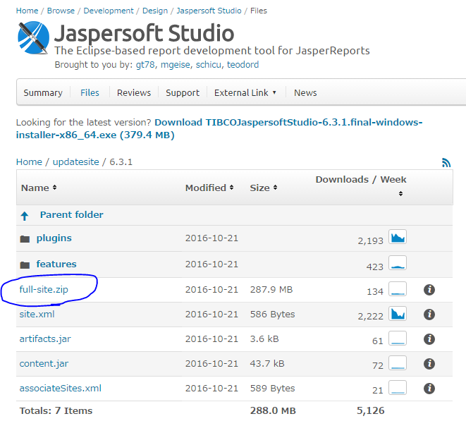
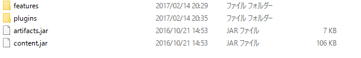
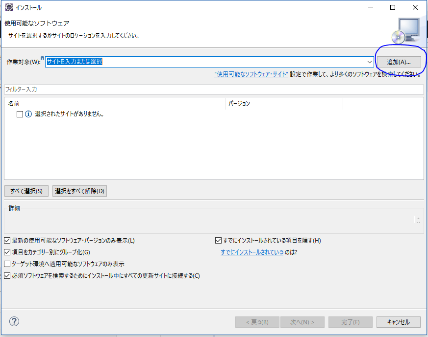
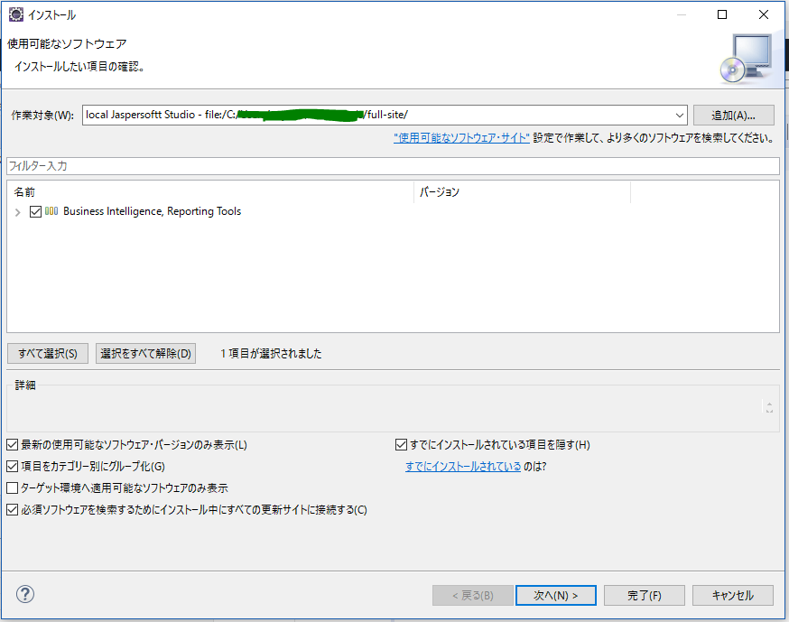
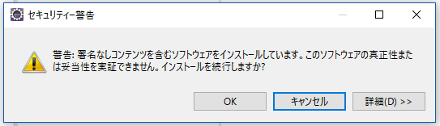

JasperReportsでPDFを出力する その1

# はじめに
JavaのWebアプリでPDFを出力するため、JasperReportsを使っています。
いくつか嵌ったポイントがあったので数回に分けて紹介したいと思います。  

今回は「EclipseプラグインのJasperstudio Studioのインストール」で嵌ったポイントと対応を紹介します。  

# 開発環境
Eclipse(pleiades4.6 Neon)

# 嵌ったポイント
「Jasperstudio Studioのインストール手順」として「EclipseマーケットプレースからJasperstudio Studioをインストール」がよく紹介されています。  

試してみましたが「ソリューションは使用できない」旨のメッセージが表示されてしまいます。  
（そのまま続行してもインストール中にエラーが発生します）  

# 対応方法
1.  [https://sourceforge.net/projects/jasperstudio/files/updatesite/6.3.1/](https://sourceforge.net/projects/jasperstudio/files/updatesite/6.3.1/)で公開されているfull-site.zipをダウンロードします。  

1.  ダウンロードしたfull-site.zipを展開します。

1.  Eclipseの新規ソフトウェアのインストールを開き、追加ボタンをクリックします。

1. リポジトリの追加で「ローカル」を選択します。  
展開したfull-siteを指定します。  
さらに名前を入力し、OKをクリックしてください。

1. 「Business Inteligence,Reporting Tools」を選択し次へボタンをクリックします。

セキュリティ警告が出ますが、OKボタンをクリックしてください。

1. Eclipseを再起動してインストール完了です。  

# おわりに
Eclipseプラグインをインストールするのも一苦労でした。  
さらっとインストールできるようになりたいなぁ。  
