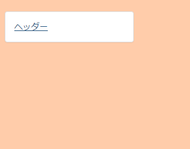
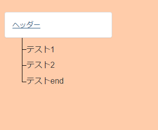
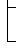

[WIP]Bootstrapでツリー表示する

# はじめに
Bootstrapでツリー表示をする方法を説明します。

今回作成するツリー表示のイメージです。  
ヘッダーをクリックすると……  
  

ツリーが表示されます  
  

# 全ソース
[https://github.com/kazenetu/blog-reports/tree/master/reports/13-bootstrap-tree/sample](https://github.com/kazenetu/blog-reports/tree/master/reports/13-bootstrap-tree/sample)をご覧ください。  


# 詳細説明

1.下記のようなイメージを作成します。  
  
 + [0,0]-[15,15]：途中の項目（テスト1、テスト2）  
 + [0,16]-[15,31]：項目の間のライン  
 + [0,32]-[15,47]：最後の項目（テストend）

2.Bootstrapのcollapseを使ってヘッダーのクリックのたびに
項目の表示制御をするように記述します。  

``` html
<div class="container container-color">
  <div class="panel panel-default tree-header">
    <div class="panel-body">
      <a data-toggle="collapse" href="#collapseExample" aria-expanded="true" aria-controls="collapseExample">
          ヘッダー
      </a>
    </div>
  </div>
  <div class="collapse" id="collapseExample">
    <div class="tree-line"></div>
    <div class="tree-start"></div>
    <div class="tree-item">テスト1</div>
    <div class="tree-line"></div>
    <div class="tree-start"></div>
    <div class="tree-item">テスト2</div>
    <div class="tree-line"></div>
    <div class="tree-end"></div>
    <div class="tree-item">テストend</div>
  </div>
</div>
```
ポイントは`tree-start`、`tree-line`、`tree-end`のdivタグです。  

3.cssを作成します。

``` css
.tree-start{
  background: url('tree.png') no-repeat 0px 0px;
  width: 16px;
  height:16px;
  float:left;
  margin-left: 2em;
}
.tree-line{
  background: url('tree.png') no-repeat 0px -16px;
  width: 16px;
  height:16px;
  margin-left: 2em;
}
.tree-end{
  background: url('tree.png') no-repeat 0px -32px;
  width: 16px;
  height:16px;
  float:left;
  margin-left: 2em;
}

.tree-header{
  width: 50%;
  background-color: smoke;
  margin-bottom:  0px !important;
}
.tree-item{
  font-size: 16px;
  margin-top: -0.2em;
  margin-left:0.5em;
  margin-bottom: -0.2em;
}
```
`tree-start`、`tree-line`、`tree-end`のクラスでは
`tree.png`を部分的に表示しています。  
また`float:left`を設定し、後続の`tree-item`クラスを同じ行に表示できるようにしています。  
そのままだと行間が空いてしまい、線が途切れてしまいます。  
`tree-item`クラスでは`margin-top`と`margin-bottom`にマイナス値を設定して線が途切れないようにしています。  


# おわりに
簡易的にですが、htmlとcssだけでツリー表示ができました。  
参考になれば幸いです。

