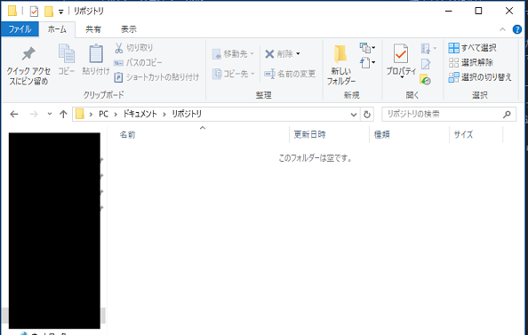
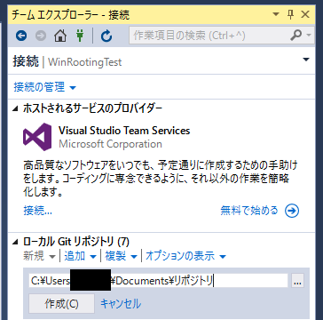
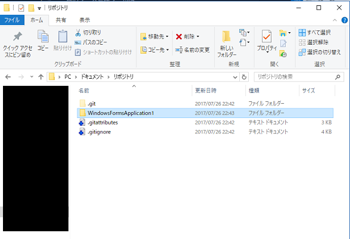
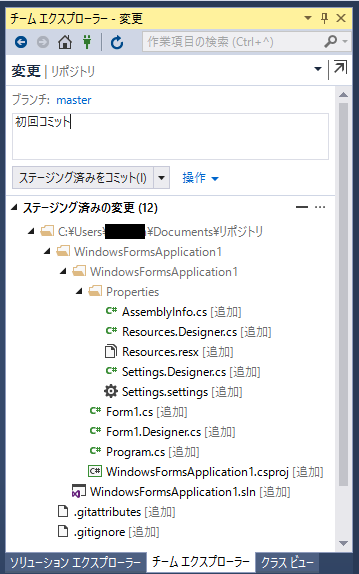

# ローカルで簡易的にソース管理する

## はじめに
昔のソース管理ツールは  
「ソースの編集時に排他ロックをかけるためにコミットするまで編集もできない」  
という仕様があったりします。  

「リポジトリから切り離したソースをローカルに作成して機能を実装」という手段を取ります。

ソース管理していないわけですから、「どこをどう直したか、追記したか」がわからなくなったり
「フォルダごとバックアップで修正箇所を保管」を繰り返したりするわけです。

今回は「リポジトリから切り離したソース」を簡易的なソース管理してみましょう。

## 利用環境
VisualStudio2015

## 手順
1. エクスプローラーでフォルダを新規作成  

1. VSを立ち上げ、ローカルGitリポジトリを新規作成  

1. エクスプローラーでローカル管理したいソースをコピー

1. リポジトリ管理しているファイルまたはフォルダを削除  
1. VSですべてコミットする  

## おわりに
上記の手順を行うと簡易的ですがローカルでもソース管理を行うことができます。  

ソース管理が行えるということは「履歴の表示」から「どこをどう直したか、追記したか」がわかるようになります。  
また「ソース修正したが元に戻したい」などの対応も可能です。  

排他ロックを行うソース管理ツールを利用しなくなった昨今、あまり役に立たないかもしれませんね。
