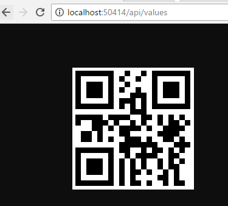

# [WIP]ASP.NET Core2でバーコードイメージを表示する

## はじめに
今回はASP.NET Coreでバーコードイメージを表示します。  
完成イメージは下記になります。  
 

## 環境
- Windows10 Home  
- .Net Core SDK 2.1.4

## 手順
1. WebAPIを作成する  
   ```dotnet new webapi -o プロジェクトフォルダ名```
1. csprojファイルに下記を追加
   - [ZXing.Net](https://www.nuget.org/packages/ZXing.Net/)
   - [System.Drawing.Common](https://www.nuget.org/packages/System.Drawing.Common/4.5.0-preview2-26406-04)
   ```
    <PackageReference Include="System.Drawing.Common" Version="4.5.0-preview2-26406-04" />
    <PackageReference Include="ZXing.Net" Version="0.16.4" />
   ```
1. ValuesController#Getメソッドを修正  
    [修正前]
    ```
    [HttpGet]
    public IEnumerable<string> Get()
    {
        return new string[] { "value1", "value2" };
    }
    ```  
      
    [修正後]
    ```
    [HttpGet]
    public ActionResult Get()
    {
      //QRコード化する文字列
      var data = "test";

      //QRコード画像の大きさを指定(pixel)
      int size = 200;

      try
      {
        // バーコード例
        //var writer = new BarcodeWriterPixelData
        //{
        //  Format = BarcodeFormat.CODE_128,
        //  Options = new EncodingOptions
        //  {
        //    Height = size / 5,
        //    Width = size
        //  }
        //};

        // QRコード例
        var writer = new BarcodeWriterPixelData
        {
          Format = BarcodeFormat.QR_CODE,
          Options = new EncodingOptions
          {
            Margin = 0,
            Height = size,
            Width = size
          }
        };

        var pixelData = writer.Write(data);

        using (var bitmap = new System.Drawing.Bitmap(pixelData.Width, pixelData.Height, System.Drawing.Imaging.PixelFormat.Format32bppRgb))
        using (var ms = new MemoryStream())
        {
          // lock the data area for fast access
          var bitmapData = bitmap.LockBits(new System.Drawing.Rectangle(0, 0, pixelData.Width, pixelData.Height),
             System.Drawing.Imaging.ImageLockMode.WriteOnly, System.Drawing.Imaging.PixelFormat.Format32bppRgb);
          try
          {
            // we assume that the row stride of the bitmap is aligned to 4 byte multiplied by the width of the image
            System.Runtime.InteropServices.Marshal.Copy(pixelData.Pixels, 0, bitmapData.Scan0,
               pixelData.Pixels.Length);
          }
          finally
          {
            bitmap.UnlockBits(bitmapData);
          }

          // save to stream as PNG
          bitmap.Save(ms, System.Drawing.Imaging.ImageFormat.Png);
          ms.Position = 0;

          return File(ms.GetBuffer(), "image/png");

        }
      }
      catch (WriterException e)
      {
        return BadRequest(e.Message);
      }
    }
    ```
    ※GitHub「[micjahn/ZXing.Net](https://github.com/micjahn/ZXing.Net/)」の「[ZXing.Net/Clients/ASP.NetCoreDemo/Helper/BarcodeTagHelper.cs](https://github.com/micjahn/ZXing.Net/blob/master/Clients/ASP.NetCoreDemo/Helper/BarcodeTagHelper.cs#L86-L127)」を参考に実装
1. デバッグ実行・動作確認  
   1. ```dotnet run```を実行  
   1. ```ルートパス/api/values```にアクセス
    

## おわりに

## 参考
ｰ GitHub:[ZXing.Net/Clients/ASP.NetCoreDemo](https://github.com/micjahn/ZXing.Net/blob/master/Clients/ASP.NetCoreDemo)