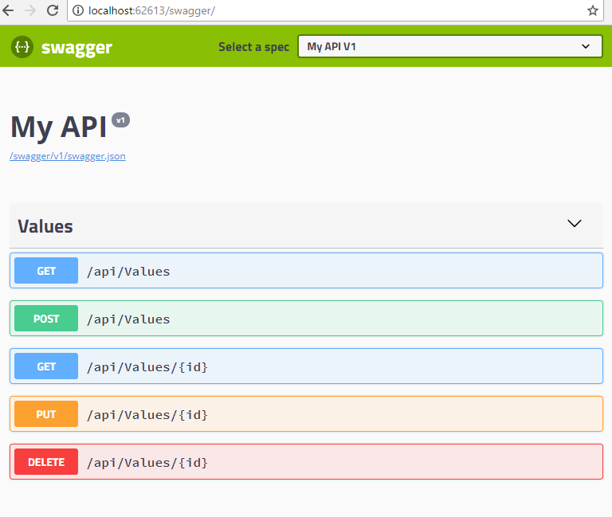

# ASP.NET Core2でSWAGGER UIを使う
- ASP.NET Core2でSWAGGER UIを使う
- [wkhtmltopdfを使ってSWAGGER UIのPDFを作成する](https://github.com/kazenetu/blog-reports/tree/master/reports/23-swaggerUItoPDF)

## はじめに
WebAPIの開発で面倒な作業というとWebAPIの仕様書です。  
ウォーターフォール開発ではWebAPIの仕様書を書くわけですが、  
実装時の試行錯誤で頻繁に実装が変わるケースはよくあることです。  
「仕様書も同期させればよい」  
ごもっともです。  

でも、仕様書が自動的に作成されるとしたら？  
仕様書の作成や更新に開放されるとしたら？  

実現方法の一つ、SWAGGER UIを紹介します。  
  


完全なサンプルコードは[sampleフォルダ](https://github.com/kazenetu/blog-reports/tree/master/reports/22-swaggerUI/sample)をご覧ください。

## 環境
- Windows10 Home  
- .Net Core SDK 2.1.4

## 手順
1. WebAPIを作成する  
   ```dotnet new webapi -o プロジェクトフォルダ名```
1. csprojファイルに下記を追加
   - クラス・メソッドのコメントをXMLで出力するように設定  
     ※DocumentationFileタグとNoWarnタグを追加
   ```
    <PropertyGroup>
      <TargetFramework>netcoreapp2.0</TargetFramework>
      <DocumentationFile>bin\Debug\$(TargetFramework)\webApi.xml</DocumentationFile>
      <NoWarn>1701;1702;1705;1591</NoWarn>
    </PropertyGroup>
   ```
   - [Swashbuckle.AspNetCore](https://www.nuget.org/packages/Swashbuckle.AspNetCore/)
   ```
    <ItemGroup>
      <PackageReference Include="Microsoft.AspNetCore.All" Version="2.0.6" />
      <PackageReference Include="Swashbuckle.AspNetCore" Version="2.4.0" />
    </ItemGroup>
   ```   
1. 実行・動作確認  
   1. ```dotnet run```を実行  
   1. ```ルートパス/swagger/```にアクセス  
    

## おわりに
こんなに簡単にWebAPIのドキュメントが自動生成されるようになりました。  
※実際には「デバッグ時のみ表示」などの制御が必要かと思います。

## 参考
- [SWAGGER UI 公式ページ](https://swagger.io/swagger-ui/)
- Qiita:[swaggerタグが付いた記事一覧](https://qiita.com/search?q=tag%3Aswagger&sort=created)